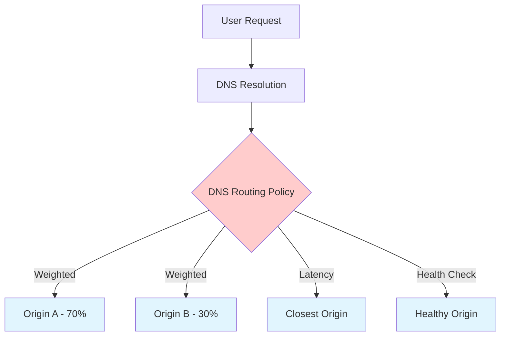
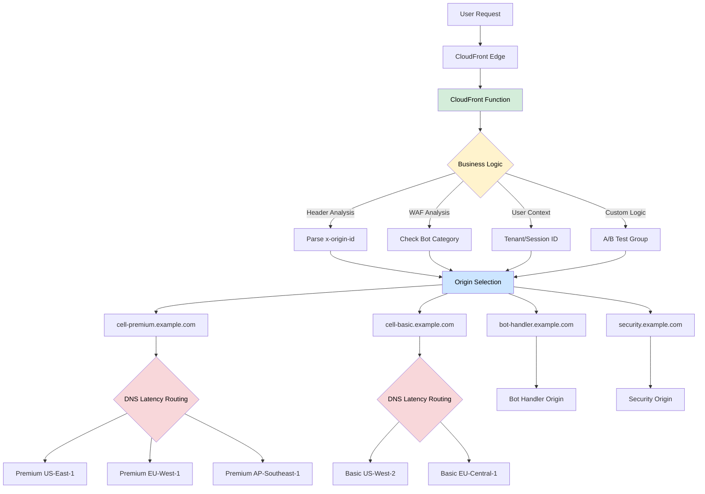
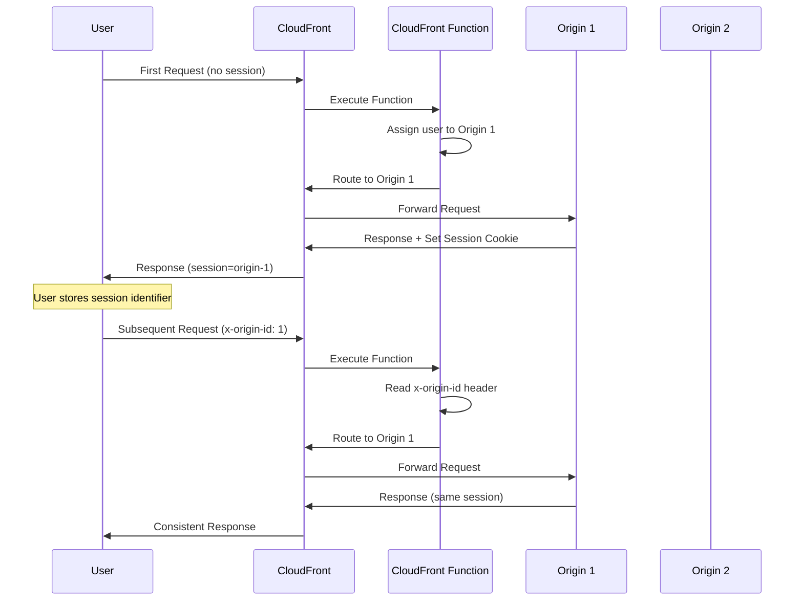
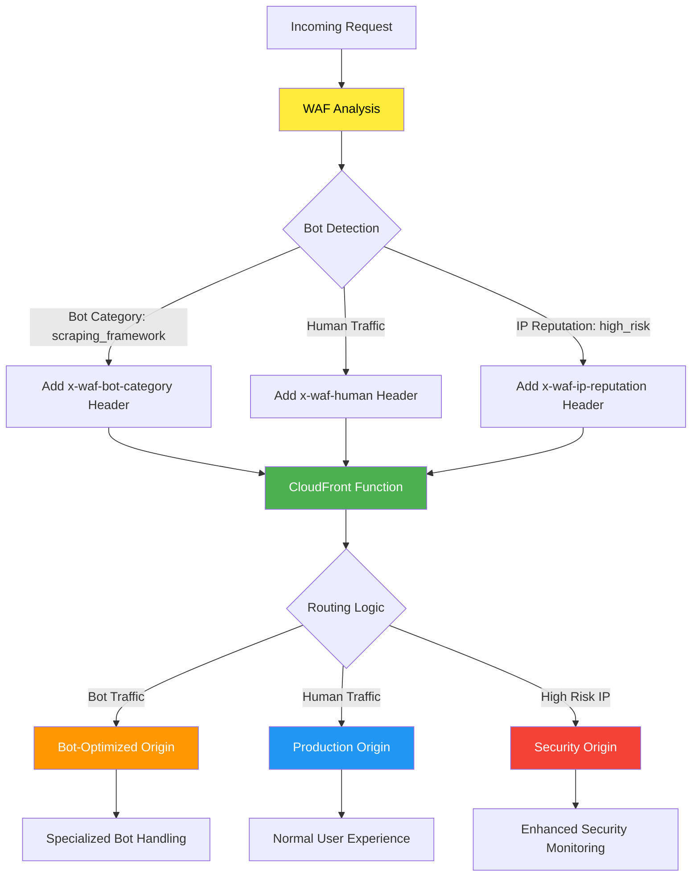
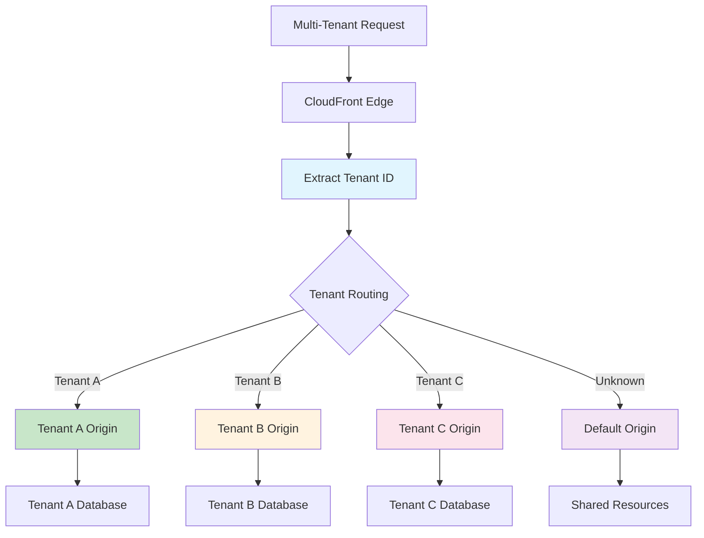
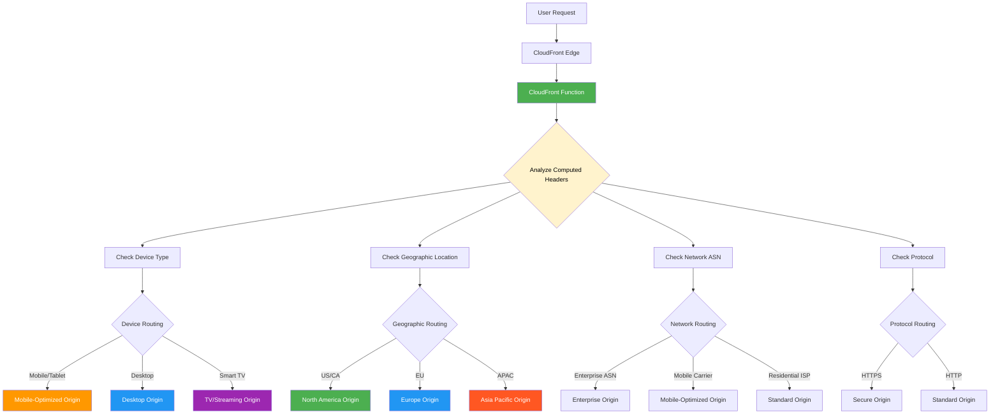
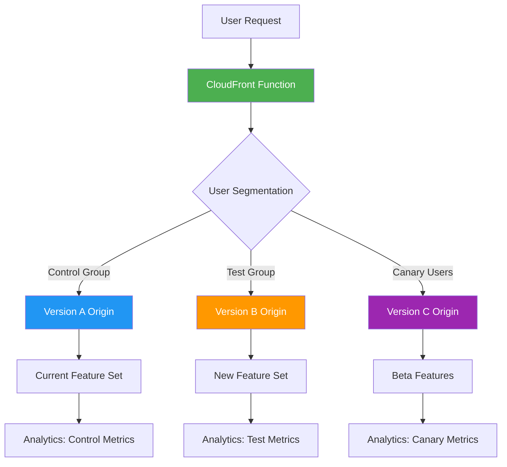
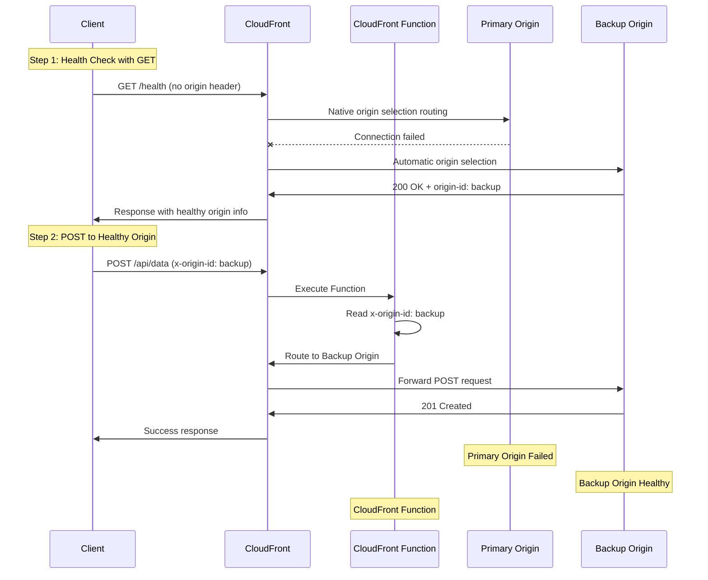

# Amazon CloudFront Programmable Origin Routing Demo

This project demonstrates **dynamic business logic routing at the edge** using Amazon CloudFront Functions and Amazon CloudFront Key Value Store (KVS). It showcases how to programmatically override traditional DNS routing (weights, latency-based, etc.) with custom edge logic to route requests across different origins like cells, regions, or environments.

**Core Concept**: Replace static DNS routing with dynamic, programmable routing decisions made at CloudFront edge locations based on request context, headers, or any custom business logic.

## Use Cases Enabled

- **User/Session Stickiness** - Route users to specific origins to maintain session state
- **Failover Logic** - Implement custom failover patterns beyond DNS health checks  
- **A/B Testing** - Route traffic to different application versions based on user segments
- **Cell-based Architecture** - Route to specific cells or shards based on user ID
- **Environment Routing** - Direct traffic to dev/staging/prod based on headers
- **Geographic Routing** - Custom geo-routing beyond CloudFront's built-in capabilities
- **Multi-tenant Isolation** - Route tenants to dedicated infrastructure
- **Canary Deployments** - Gradually shift traffic with fine-grained control
- **Bot/Crawler Management** - Route AI crawlers, bots, or scrapers to dedicated origins
- **Security-based Routing** - Route suspicious traffic to isolated environments

## Architecture Overview

![A component diagram showing the architecture of the CloudFront Programmable Origin Routing Demo. The diagram illustrates a CloudFront distribution with a CloudFront Function and Key Value Store that routes requests to multiple Application Load Balancer origins based on request headers and business logic. The flow shows user requests coming into CloudFront, being processed by the CloudFront Function which consults the Key Value Store, and then being routed to the appropriate ALB origin. The diagram also shows Route 53 DNS integration for endpoint management.](./docs/diagrams/components-diagram.png)

The demo creates:
- **Multiple Application Load Balancer (ALB) origins** (3 by default) with independent backend services
- **CloudFront distribution** with intelligent origin selection
- **CloudFront Function** that routes users based on the `x-origin-id` header
- **CloudFront Key Value Store** mapping user/session identifiers to specific origins
- **Interactive demo app** to test session stickiness behavior
- **Amazon Route 53 DNS** for clean endpoint management

## Programmable Routing vs Traditional DNS

### Traditional DNS Routing Limitations
DNS-based routing has fundamental constraints that limit real-time control:

**Caching Impact on Control:**
- **Client DNS caching** - Browsers and OS cache DNS responses for minutes to hours (TTL-dependent)
- **ISP DNS caching** - Internet service providers cache responses independently of your TTL settings
- **CDN DNS caching** - Multiple layers of DNS caches between your changes and end users
- **Delayed propagation** - DNS changes can take minutes to hours to reach all clients
- **No per-request control** - Once DNS is cached, you lose control until cache expires

**Technical Limitations:**
- **Weighted routing** - Fixed percentage splits that can't adapt to real-time conditions
- **Latency-based** - Routes to best latency origin based on AWS measurements, but can't consider business logic or user context
- **Health checks** - Basic up/down status with limited failover logic
- **Geolocation** - Broad geographic regions only, no fine-grained targeting
- **No request context** - Cannot route based on headers, user attributes, or dynamic conditions



**Critical DNS Caching Problem:**
DNS routing decisions are made at resolution time and then cached at multiple layers:
```
User Request → Local DNS Cache (hours) → ISP DNS Cache (varies) → Your DNS Changes
```
This means:
- A DNS routing change affects only NEW DNS resolutions
- Existing cached entries continue using OLD routing for hours
- You cannot instantly redirect traffic or implement emergency routing changes
- Gradual traffic shifts take hours to complete due to cache expiration timing
- No ability to route individual requests differently

### CloudFront Edge Routing Advantages
Edge routing provides instant, per-request control:

**Immediate Propagation:**
- **Sub-second updates** - CloudFront Function changes expect to propagate to all edge locations within seconds
- **No client caching** - Routing decisions made fresh for every single request
- **Instant failover** - Emergency routing changes expect to take effect immediately
- **Real-time control** - Modify routing behavior without waiting for cache expiration
- **Per-request granularity** - Each request can be routed independently based on its context

**Advanced Capabilities:**
- **Request-aware** - Route based on headers, cookies, query parameters, user agents
- **Business logic** - Implement custom routing rules in JavaScript at the edge
- **Context-sensitive** - Consider user ID, tenant, experiment groups, session state
- **AWS WAF integration** - Route based on threat analysis and bot detection
- **Dynamic updates** - Change routing behavior via KVS without code deployments
- **CloudFront computed headers** - Access rich network and device context automatically provided by CloudFront:
  - **Geographic**: `cloudfront-viewer-country` (2-letter country code)
  - **Network**: `cloudfront-viewer-asn` (Autonomous System Number)
  - **Device detection**: `cloudfront-is-mobile-viewer`, `cloudfront-is-tablet-viewer`, `cloudfront-is-desktop-viewer`, `cloudfront-is-smarttv-viewer`
  - **Protocol**: `cloudfront-forwarded-proto` (HTTP/HTTPS)
  - **Language**: Access to `accept-language` header for localization



## Key Components

### CloudFront Function Origin Router
Routes requests based on headers or business logic:

**Simple Approach - Static Mapping in Function:**
```javascript
// Simple static mapping within the function
const originMap = {
  '__default__': 'primary-origin.example.com',
  '0': 'origin-0.example.com',
  '1': 'origin-1.example.com',
  '2': 'origin-2.example.com'
};

const originId = (request.headers['x-origin-id'] && request.headers['x-origin-id'].value) || '__default__';
const targetOrigin = originMap[originId] || originMap['__default__'];
```

**Advanced Approach - Dynamic KVS Mapping:**
```javascript
// Dynamic mapping using KVS (for runtime updates)
const originId = request.headers['x-origin-id'] && request.headers['x-origin-id'].value;
try {
  const targetOrigin = await kvsHandle.get(originId || '__default__');
  if (targetOrigin) {
    cf.updateRequestOrigin({ "domainName": targetOrigin });
  }
} catch (error) {
  // Key not found in KVS - fall back to default
  try {
    const defaultOrigin = await kvsHandle.get('__default__');
    if (defaultOrigin) {
      cf.updateRequestOrigin({ "domainName": defaultOrigin });
    }
  } catch (fallbackError) {
    // Even default key missing - let CloudFront use configured origin
    console.log('No KVS mapping found, using CloudFront default origin');
  }
}
```

**WAF-Enhanced Routing:**
```javascript
// Route based on WAF analysis headers
const wafBotCategory = request.headers['x-waf-bot-category'] && request.headers['x-waf-bot-category'].value;
const wafThreatType = request.headers['x-waf-threat-type'] && request.headers['x-waf-threat-type'].value;
const wafIpReputation = request.headers['x-waf-ip-reputation'] && request.headers['x-waf-ip-reputation'].value;

let originId = '__default__';
if (wafBotCategory === 'scraping_framework' || wafBotCategory === 'http_library') {
  originId = 'bot-origin';  // Dedicated origin for bots/crawlers
} else if (wafThreatType === 'malicious' || wafIpReputation === 'high_risk') {
  originId = 'enhanced-security-origin';  // Origin with enhanced security features for suspicious traffic
} else if (wafIpReputation === 'anonymous_proxy') {
  originId = 'proxy-origin';  // Special handling for proxy traffic
}
```

### Origin Mapping Examples
```json
{
  "__default__": "primary-origin.example.com",
  "0": "origin-0.example.com",
  "1": "origin-1.example.com", 
  "2": "origin-2.example.com",
  "tenant-a": "tenant-a-origin.example.com",
  "canary": "canary-origin.example.com",
  "bot-origin": "bot-crawler-origin.example.com",
  "enhanced-security-origin": "enhanced-security-origin.example.com"
}
```

## Usage

### Prerequisites
- AWS CLI configured with appropriate permissions
- Node.js 20+ installed
- Docker installed
- A Route 53 hosted zone (for DNS configuration)

### Setup

1. **Install dependencies**
```bash
npm ci && (cd demo-client ; npm ci)
```

2. **Bootstrap AWS CDK** (if not already done)
```bash
npx cdk bootstrap
```

3. **Configure DNS settings** in [lib/consts.ts](./lib/consts.ts)
```typescript
export const DNS_PROPS = {
    zoneName: "example.com",              // Replace with your hosted zone
    hostedZoneId: "Z1D633PJN98FT9",       // Replace with your hosted zone ID
    recordName: "api"                     // Subdomain for the API
}
```

4. **Verify the CDK stack** synths correctly
```bash
npx cdk synth
```

5. **Deploy the infrastructure**
```bash
npx cdk deploy
```

6. **Test session stickiness** using the deployed endpoints

### Testing Session Stickiness

After deployment, test how users stick to specific origins:

```bash
# User without session - goes to default origin
curl https://d1234567890abc.cloudfront.net/api

# User with session ID - always goes to origin 0
curl -H "x-origin-id: 0" https://d1234567890abc.cloudfront.net/api

# Different user - goes to origin 1
curl -H "x-origin-id: 1" https://d1234567890abc.cloudfront.net/api
```

## Implementation Patterns

### Client-Side Session Management
```javascript
// Store user's assigned origin in localStorage/cookie
const userOrigin = localStorage.getItem('userOrigin') || assignNewOrigin();

// Always include origin header in requests
fetch('/api/data', {
  headers: { 'x-origin-id': userOrigin }
});
```

### Server-Side Session Assignment
```javascript
// Assign users to origins based on user ID hash
const assignOrigin = (userId) => {
  return String(userId.hashCode() % numberOfOrigins);
};

// Include in all API calls for this user
const originId = assignOrigin(currentUser.id);
```

### Multi-Tenant Isolation
```javascript
// Route tenants to dedicated origins
const tenantOriginMap = {
  'tenant-a': '0',
  'tenant-b': '1', 
  'tenant-c': '2'
};

const originId = tenantOriginMap[user.tenantId];
```

### POST Request Origin Discovery Pattern (can be used for POST requests failovers)
```javascript
// Step 1: Use GET request to discover healthy origin
const discoverHealthyOrigin = async () => {
  try {
    // Make a simple GET request - CloudFront will use native origin selection
    const response = await fetch('/api/health');
    if (response.ok) {
      // If we get a successful response, we know this path works
      // We can extract origin info from response headers or body if available
      const originHeader = response.headers.get('x-served-by-origin');
      return originHeader || 'default'; // Use origin info if provided
    }
  } catch (error) {
    console.log('Primary path failed, will use backup');
  }
  
  // If primary fails, try with backup origin header
  try {
    const backupResponse = await fetch('/api/health', {
      headers: { 'x-origin-id': 'backup' }
    });
    if (backupResponse.ok) {
      return 'backup';
    }
  } catch (error) {
    console.log('Backup also failed');
  }
  
  return 'default'; // Final fallback
};

// Step 2: Use discovered healthy origin for POST request
const submitData = async (payload) => {
  const healthyOrigin = await discoverHealthyOrigin();
  
  const headers = {
    'Content-Type': 'application/json'
  };
  
  // Only add origin header if we discovered a specific one
  if (healthyOrigin !== 'default') {
    headers['x-origin-id'] = healthyOrigin;
  }
  
  return fetch('/api/data', {
    method: 'POST',
    headers,
    body: JSON.stringify(payload)
  });
};
```

## Use Case Examples

### E-commerce Shopping Cart
- Users assigned to specific origins maintain cart state locally
- No need for shared cart database
- Fast cart operations with server-side storage

### Gaming Sessions
- Players connected to specific game servers
- Maintain game state without external coordination
- Reduced latency for real-time interactions

### Development Environments
- Route developers to their dedicated environments
- Isolated testing without interference
- Personal development instances

### Geographic Data Compliance
- Route users to origins in their data residency region
- Maintain compliance with local data laws
- Consistent user experience within regions

### POST Request Origin Discovery
- Use GET requests to discover healthy origins via CloudFront's native origin selection
- Follow up with POST requests using origin headers to ensure delivery to healthy endpoints
- Combine native CloudFront origin selection with programmable routing for write operations

## Use Case Diagrams

### Session Stickiness Flow


### WAF-Based Bot Routing


### Multi-Tenant Architecture


### Device and Network-Aware Routing


**CloudFront Computed Headers Example:**
```javascript
// Access rich context automatically provided by CloudFront
const deviceType = request.headers['cloudfront-is-mobile-viewer']?.value === 'true' ? 'mobile' :
                  request.headers['cloudfront-is-tablet-viewer']?.value === 'true' ? 'tablet' :
                  request.headers['cloudfront-is-desktop-viewer']?.value === 'true' ? 'desktop' :
                  request.headers['cloudfront-is-smarttv-viewer']?.value === 'true' ? 'tv' : 'unknown';

const country = request.headers['cloudfront-viewer-country']?.value; // 'US', 'DE', 'JP', etc.
const asn = request.headers['cloudfront-viewer-asn']?.value; // Autonomous System Number
const protocol = request.headers['cloudfront-forwarded-proto']?.value; // 'https' or 'http'
const language = request.headers['accept-language']?.value; // 'en-US,en;q=0.9'

// Route based on device type and geography
let originId = '__default__';
if (deviceType === 'mobile' || deviceType === 'tablet') {
  originId = `mobile-${country?.toLowerCase() || 'global'}`;
} else if (deviceType === 'tv') {
  originId = 'streaming-optimized';
} else if (country === 'US' || country === 'CA') {
  originId = 'na-desktop';
} else if (['DE', 'FR', 'GB', 'IT', 'ES'].includes(country)) {
  originId = 'eu-desktop';
} else {
  originId = 'apac-desktop';
}

// Additional routing based on network characteristics
if (asn && enterpriseASNs.includes(asn)) {
  originId = `enterprise-${originId}`;
}
```

### A/B Testing Flow


### POST Request Origin Discovery Pattern


## Interactive Demo

The `/demo-client` folder contains a React application that demonstrates:
- Session assignment and stickiness
- Visual representation of user-to-origin routing
- Comparison between sticky and non-sticky requests
- Real-time session tracking

See [demo-client/DEMO_README.md](./demo-client/DEMO_README.md) for detailed instructions.

## Advanced Configuration

### Dynamic Session Assignment
Update the CloudFront Function to implement intelligent assignment:
```javascript
// Assign based on load balancing, user location, etc.
const assignOptimalOrigin = async (userId) => {
  // Custom logic for origin selection
  return optimalOriginId;
};
```

### Session Migration
Implement graceful session migration while preserving sessions:
```javascript
// Fallback to secondary origin if primary fails
const getOriginWithFallback = async (sessionId) => {
  try {
    const primary = await kvsHandle.get(sessionId);
    return primary;
  } catch (error) {
    // Primary session mapping not found, try backup
    try {
      const fallback = await kvsHandle.get(`${sessionId}_backup`);
      return fallback;
    } catch (backupError) {
      // No backup found either, use default
      try {
        const defaultOrigin = await kvsHandle.get('__default__');
        return defaultOrigin;
      } catch (defaultError) {
        // No default in KVS, let CloudFront handle
        return null;
      }
    }
  }
};
```

### Session Migration
Handle cases where sessions need to move between origins:
- Update KVS mappings
- Implement session data transfer
- Graceful user migration

### Hierarchical Routing: CloudFront Functions + DNS
Combine CloudFront Function routing with DNS-based routing for multi-level decisions:

**Use Case**: Route users to specific cells, then let DNS handle region selection within each cell.

```javascript
// CloudFront Function routes to cell-specific domains
const cellMap = {
  '__default__': 'cell-a.example.com',
  'user-segment-premium': 'cell-premium.example.com',
  'user-segment-basic': 'cell-basic.example.com',
  'tenant-enterprise': 'cell-enterprise.example.com'
};

// Each cell domain has DNS latency-based routing
const userSegment = request.headers['x-user-segment'] && request.headers['x-user-segment'].value;
const tenantType = request.headers['x-tenant-type'] && request.headers['x-tenant-type'].value;

let cellDomain;
if (tenantType === 'enterprise') {
  cellDomain = cellMap['tenant-enterprise'];
} else if (userSegment === 'premium') {
  cellDomain = cellMap['user-segment-premium'];
} else if (userSegment === 'basic') {
  cellDomain = cellMap['user-segment-basic'];
} else {
  cellDomain = cellMap['__default__'];
}

cf.updateRequestOrigin({ "domainName": cellDomain });
```

**DNS Configuration for Each Cell:**
```
# cell-premium.example.com DNS records
cell-premium.example.com  300  IN  A  203.0.113.10  ; us-east-1 (latency-based)
cell-premium.example.com  300  IN  A  203.0.113.20  ; eu-west-1 (latency-based)
cell-premium.example.com  300  IN  A  203.0.113.30  ; ap-southeast-1 (latency-based)

# cell-basic.example.com DNS records  
cell-basic.example.com    300  IN  A  203.0.113.40  ; us-west-2 (latency-based)
cell-basic.example.com    300  IN  A  203.0.113.50  ; eu-central-1 (latency-based)
```

**Benefits of This Pattern:**
- **Business Logic at Edge** - CloudFront Function handles user segmentation, tenancy, A/B testing
- **Performance Optimization** - DNS handles geographic/latency-based routing within each cell
- **Scalability** - Each cell can have different regional deployments
- **Flexibility** - Easy to add/remove regions per cell without changing CloudFront Function
- **Cost Optimization** - Premium users get global presence, basic users get cost-optimized regions

**Example Flow:**
1. **User Request** → CloudFront Edge
2. **CloudFront Function** → Analyzes headers, routes to `cell-premium.example.com`
3. **DNS Resolution** → Routes to closest region within premium cell (us-east-1, eu-west-1, or ap-southeast-1)
4. **Final Routing** → User reaches premium infrastructure in their optimal region

## Security Considerations

### Production Header Security
**⚠️ Important**: This demo uses simple, predictable headers for educational purposes. In production environments, use obfuscated header names and values to prevent origin unintended access:

**Demo (Educational Only):**
```javascript
// ❌ Avoid in production - too predictable
const originId = request.headers['x-origin-id']?.value; // '0', '1', '2'
```

**Production (Recommended):**
```javascript
// ✅ Production approach - obfuscated and secure
const routingToken = request.headers['x-routing-token']?.value;
const sessionHash = request.headers['x-session-hash']?.value;

// Use hashed/encrypted values instead of simple integers
const originMapping = {
  'a7f3k9m2': 'origin-primary',
  'b8g4l0n3': 'origin-secondary', 
  'c9h5m1o4': 'origin-tertiary'
};
```

### Additional Security Measures
- **Header validation**: Implement strict validation of header values
- **Rate limiting**: Apply rate limits per header combination
- **Monitoring**: Log and monitor unusual routing patterns
- **Encryption**: Consider encrypting routing tokens
- **Rotation**: Regularly rotate header names and values
- **WAF integration**: Use WAF rules to block unauthorized routing attempts

### Example Secure Implementation
```javascript
// Production-ready routing with enhanced security features
const validateAndRoute = async (request) => {
  const routingToken = request.headers['x-rt'] && request.headers['x-rt'].value;
  const timestamp = request.headers['x-ts'] && request.headers['x-ts'].value;
  
  // Validate token format and timestamp
  if (!isValidToken(routingToken) || isExpired(timestamp)) {
    return getDefaultOrigin();
  }
  
  // Decrypt/decode the routing token
  const originId = await decryptRoutingToken(routingToken);
  return await getOriginWithEnhancedSecurity(originId);
};
```

## Benefits of Edge-Based Session Stickiness

- **Performance**: No database lookups for session routing
- **Scalability**: Leverages CloudFront's global infrastructure  
- **Simplicity**: Reduces backend complexity
- **Reliability**: Built-in failover capabilities
- **Cost-Effective**: Minimal overhead for session management
- **Global**: Works across all CloudFront edge locations

## Cleanup

Remove all resources:
```bash
npx cdk destroy
```

## Contributing

This sample demonstrates CloudFront-based session stickiness patterns. Contributions for additional use cases and improvements are welcome!

